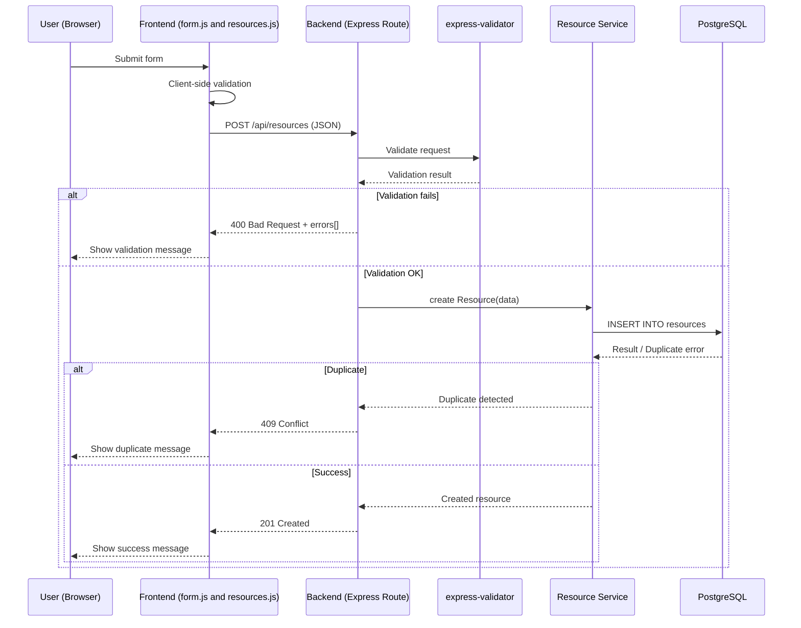
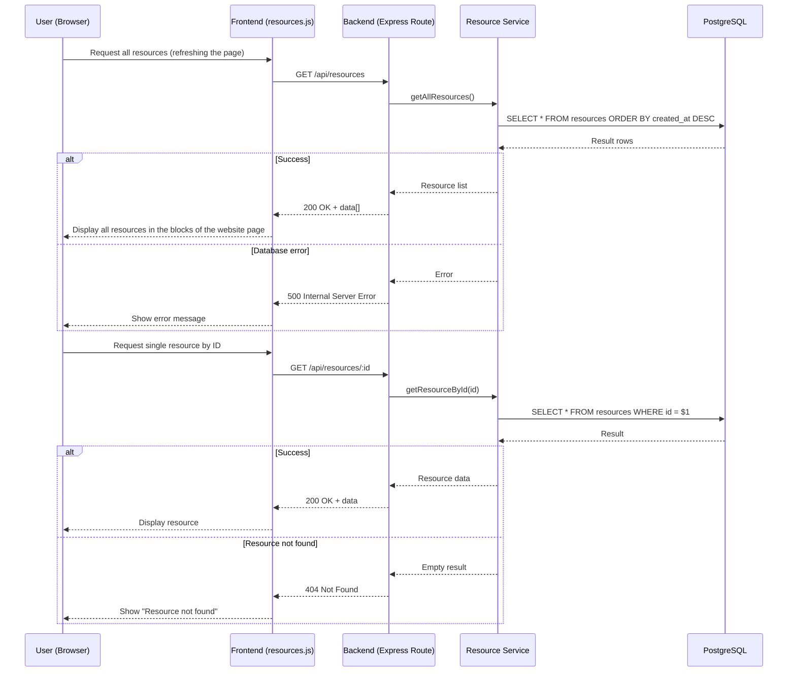

# 1️⃣ CREATE – RResource (Sequence Diagram)



# 2️⃣ READ — Resource (Sequence Diagram)



# 3️⃣ UPDATE — Resource (Sequence Diagram)

```mermaid
```

# 4️⃣ DELETE — Resource (Sequence Diagram)

```mermaid
```
